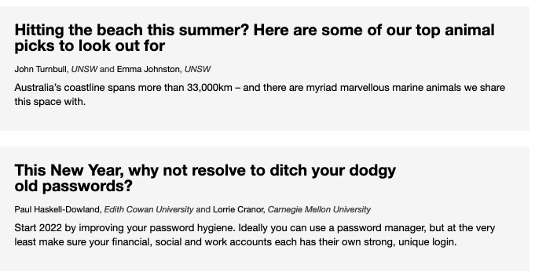
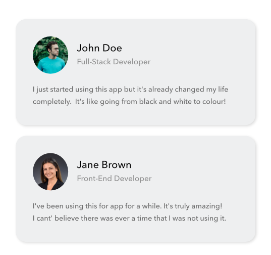
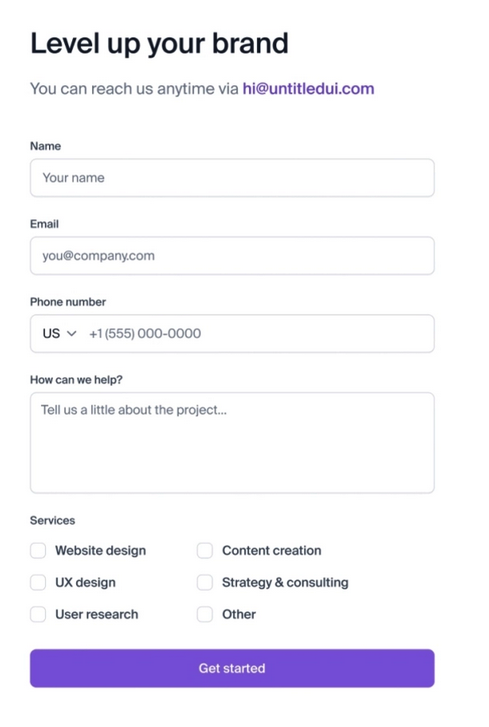
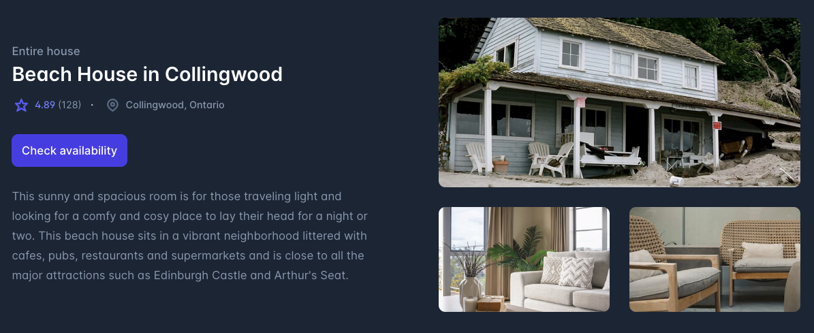

# Week 1 Exercises

For each exercise, your task is to recreate the image using html and css. You **don't** have to have to make the font, sizing, margins etc. exactly as it is in the image. Just make it look like it by eye.

Please make a folder for each exercise if it doesn't already exist. Exercise 2 and 4 have assets which have already been added to those folders.

Also, you'll find that a color picker app/chrome extension may help you get the colours you need from the image.  Here's one you can try: [ColorPick Eyedropper](https://chrome.google.com/webstore/detail/colorpick-eyedropper/ohcpnigalekghcmgcdcenkpelffpdolg).

I highly recommend you look into learning css flexbox and maybe css grid if you have time. These will be useful for doing layouts.

## Exercise 1

## Exercise 2

## Exercise 3

## Exercise 4

